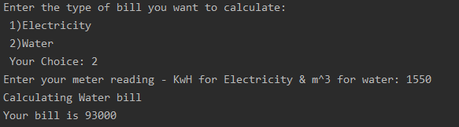
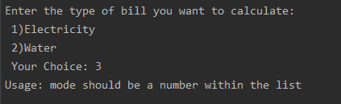

## Bill Calculator
In this project you will build a program that calculates two types of bills: 1) Electricity 2) Water

## Program Flow & Task Description
The program should start by asking a user what kind of bill he/she wants to calculate by choosing a number from the list.
- Bill type can be
    1. Electricity
    2. Water
- When a user provides a choice. Another question should be posted concerning meter reading. Reading are to be accepted in KwH for electricity and m^3 for water.
- After all inputs are allocated - some kind of a loading/calculating message should be posted and then the calculated bill value is to be posted in a separate line.

Please check Example part to check the clear flow of questions that are expected within the program.

## Guidelines
- **Bill Calculation:** you need to use many __if__ statements with several conditions to calculate bills:
- Electricity
    - first 100 kwH are 5 $ per kwH including 100
    - from 100 kwH to 1000 kwH are 10 $ per kwH
    - After 1000 kwH are 15 $ per kwH
- Water
    - first 500 m^3 are 50 $ per m^3 not including 500
    - from 500 m^3 to 2500 m^3 are 60 $ per m^3
    - After 2500 kwH are 70 $ per kwH
    
- **Input Validation:** your program should **NOT** crash when a user inputs a wrong value. Your code should be able to let the user know that the input is not correct.
For example, if a user enters the value __5__ at the bill list which have __1__ and __2__ only -> the program is expected to print a **Usage** statement and guide the user to input a correct value. The program is expected to exit at this point with no further processing.
Input validation should cover both questions: Bill type and Meter reading.

- **Slices:** As specified at point one, price is to be sliced into three ranges, each with a price. You may need to define these fixed values at the beginning of your program so that you can easily use them within the code.
This is also useful if these numbers change. Imagine that a unit price changes frequently -> you only need to change your fixed values leaving other parts of code intact.

## Starter Code
Check the file called `main.py` for the general expected structure of the code. Start by implementing needed TODOs.

## Example Run
Here are some running examples:
- Successful inputs with calculated output: 

- Failure on first input (bill type):       

- Failure on second input (meter reading): 

## Bonus Item 
Add a quick feature to let the user know if usage is **normal** or **above average**
 - Add another question to ask the user for the number of household
 - Perform input validation for this new input also -> it should be numeric and between 0 = 20
 - Try to use fixed values as you did before
 - Calculate the the usage per person by: __usage per person = (bill/household)__
 - Check the per person usage exceeds normal value:
    - For electricity: let the normal per person usage equal to 300
    - For water: let the normal per person usage equal to 5000
 - Change fixed values to check that your code works fine
 - Output Examples: find below some examples for the new expected output
 
 
 
 
 