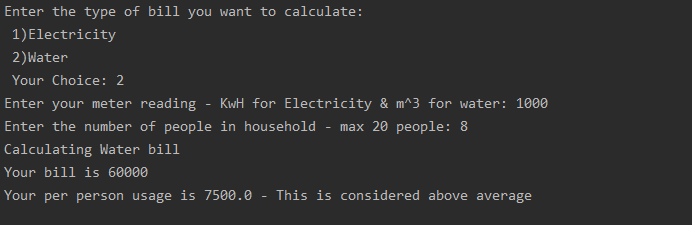
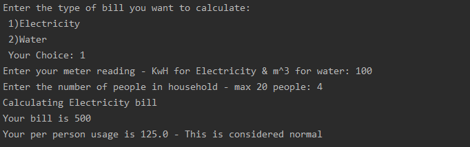

# Bill Calculator

Utility bills are subject to lots of regulations. There are a ton of rules that
govern how much water and electricity cost, based on many different factors. 
Thankfully, you've been practicing with conditional statements. Conditions help
represent rules in Python programs.

In this project, you will build a program to help calculate Electricity and 
Water bills, turning the utility bill rules into conditions and boolean logic.

## Your Task

Listed below are the rates for calculating water and electricity bills. Your job
is to turn those rates into a calculator program that can help someone determine
what they will need to pay, based on their usage.

The program should start by asking the user what type of bill they want to 
calculate, by choosing a number from the list.

```txt
1. Electricity
2. Water
```

Then, the program should ask for the relevant meter reading, in kilowatt-hours 
(kwH) for electricity and cubic meters (m^3) for water. 

Then, the program should display a 'calculating' message, then display the 
calculated bill.

See the Expected Results section for examples of a correctly running program.

## Utility Bill Rates

These are the rules that govern the bill calculation for Electricity and Water.
You'll need to translate these into the boolean logic and math to correctly
calculate the bills.

### Electricity

- The first 100 kwH: $5 per kwH 
- 100 kwH to 1000 kwH: $10 per kwH
- More than 1000 kwH: $15 per kwH

### Water

- The first 500 m^3: $50 per m^3
- 500 m^3 to 2500 m^3: $60 per m^3
- 2500 kwH and more $70 per kwH

## Further Guidelines

**Input Validation:** your program should **NOT** crash when a user enters an 
invalid value. Your code should print an error message to let the user know that
the input is not correct, and exit.

For example, if a user enters the value **5** when the menu shows only options 
**1** and **2**, then the program should to print an **Error** to guide the user 
to input a correct value. The program should exit with no further processing.

The program should validate all user inputs, for both bill type and meter reading.

**Constant values:** As specified in the Utility Bill Rates, the price is sliced 
into three ranges, based on the usage. You should define constant values at the 
beginning of your program and use those variables in the rest of your program.
Avoid magic numbers in your conditional statements!

If the numbers in the Utility Bill Rates changed, you should only have to change 
the constants at the top of your program, leaving other parts of code intact.

## Starter Code

Write your solution in `main.py`. The starter code contains the general expected 
structure of the code, and lists several TODOs.

## Expected Results

Successfully calculating Electricity bill: 

```txt
$ python main.py
Enter the type of bill you want to calculate:
 1) Electricity
 2) Water
 Your Choice: 1
Enter your electric meter reading in kwH: 14
Calculating Electricity bill...
Your total Electricity bill is $70
```

Successfully calculating Water bill: 
```txt
$ python main.py
Enter the type of bill you want to calculate:
 1) Electricity
 2) Water
 Your Choice: 2
Enter your water meter reading in m^3: 621
Calculating Water bill...
Your total Water bill is $37260
```

Failure on first input (bill type): 

```txt
$ python main.py
Enter the type of bill you want to calculate:
 1) Electricity
 2) Water
 Your Choice: 5
Error: enter a number to choose a bill type from the list
```

Failure on second input (meter reading): 
```txt
$ python main.py
Enter the type of bill you want to calculate:
 1) Electricity
 2) Water
 Your Choice: 2
Enter your water meter reading in m^3: two thousand meters cubed
Error: Please enter a numerical meter reading
```

## Bonus Task

Once you have the basics working, you can try adding a feature to let the user 
know if their usage is **normal** or **above average**

- Add another question for the number people in their household
- Remember to validate this new input (an integer between 0 and 20)
- Calculate the the usage per person by: **usage per person = (bill/household)**
- Check if the per person usage exceeds normal value:
    - For electricity: assume the normal per-person usage is 300
    - For water: assume the normal per-person usage is 5000

Here are the expected results for the bonus task:
 

 

